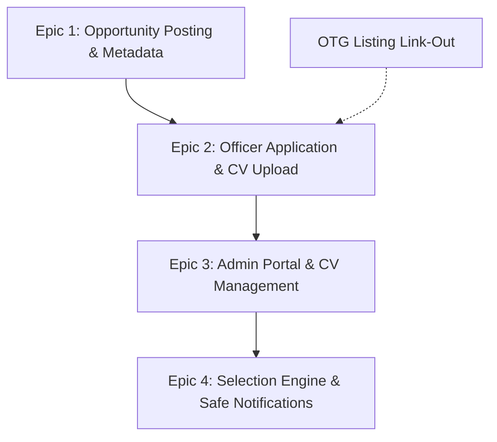

# MVP Scope Document: CareerCompass R1 Opportunities

**Document Type:** MVP Scope Document and Engineering Anchor  
**Date:** 2026-09-11  
**Target Release:** CareerCompass R1  
**Scope:** Core Opportunities Platform (STIPs, Gigs, SJRs, Internal Jobs, Secondments)  
**Owner:** Michelle Yip (PM, PSD)  
**Stakeholders / Reviewers:** Adrian Ang (Product Lead), Li Ting Kway (Design), Pow Hwee (Tech Lead)  

---

## 1. Problem Statement

Cross-program analysis of public sector mobility data (Gigs and Short Job Rotations) reveals a systemic measurement failure:
- **89% of SJR opportunities have zero recorded outcome** (and approving moderator ID is blank on 100% of gig applications all-time because there is zero policy need for an approving moderator in gigs or SJRs). Because legacy systems failed to capture selections or rejections, current placement metrics represent an artificial floor.
- **90% candidate churn:** Only 10% of active applicants ever return for subsequent cycles, driven by weeks of post-submission silence.
- **Serial applicant distortion:** A single officer submitted 112 applications in 2026, and 11 officers filed 39% of 2025 applications. Lacking structured grade gates, unqualified applicants spray-and-pray, flooding hiring teams with noise.
- **Tool abandonment:** Because legacy tools lack CV collection and flexible hours, agencies abandon internal platforms for FormSG, Careers@Gov, and manual spreadsheets.
- **Distribution failure:** 45% of postings draw 0 or 1 candidate, reflecting poor discovery visibility across agencies.

---

## 2. Goals and Success Criteria

### Strategic Goals
- Establish CareerCompass as the primary authoring, discovery, and application surface for R1 opportunities across pilot agencies.
- Fix the measurement loop by turning outcome recording into an integrated, low-friction administrative action.
- Eliminate the operational need for external FormSG and Careers@Gov workarounds for pilot agencies.
- Provide applicants with transparent in-app status updates and rapid closure, ending candidate silence.

### Measurable Success Criteria (Baselined Against Current Workbooks)
- **Outcome Recording Compliance:** Increase recorded opportunity outcomes from **11% (current baseline) to ≥ 80%** within 30 days of cycle close.
- **Candidate Return Rate:** Lift the repeat applicant return rate from **10% (current baseline) to ≥ 25%** over subsequent cycles by eliminating candidate ghosting.
- **Low-Applicant Role Reduction:** Reduce postings receiving 0 or 1 applicant from **45% (current baseline) to < 25%** via unified Compass search discovery.
- **Zero FormSG Detours for Substantive Roles:** 100% of pilot agency SJR, Internal Job, and Secondment postings accept applications and CVs natively in Compass.
- **Application Completion Rate:** ≥ 85% of officers who initiate a substantive application complete it with CV attached.
- **Administrative Time Savings:** Reduce HR time spent downloading, sorting, and packaging candidate CVs by at least 50% via batch ZIP export.

---

## 3. Clustered MVP Epics

---

### Epic 1: Opportunity Posting and Metadata

**Objective:** Enable HR and hiring managers to post opportunities directly within Compass without resorting to external systems.

| Story ID | User Story | Functional Requirements | Acceptance Criteria |
|---|---|---|---|
| **OPP-01** | As an HR officer or hiring manager, I want to create opportunity postings in Compass so that I do not need external tools. | - Support core opportunity types (STIP, Gig, SJR, Internal Job, Secondment). - Fields: Title, Description, Posting Agency, Work Location, Cycle Dates, Application Deadline. | - Opportunity type selector displays valid options. - Postings persist in database and display properly on Compass web surfaces. |
| **OPP-02** | As an HR officer, I want to post long-hour roles so that I can advertise full rotation commitments and vacancies. | - Remove arbitrary short-duration limits on opportunity duration fields. - Allow flexible hour specifications (e.g. project blocks, standard rotations, full-time postings). | - Posting form accepts long-hour commitments without schema validation errors. - Opportunity card displays duration cleanly to officers. |
| **OPP-03** | As an applicant and HR officer, I want job grade as a structured field so that requirements are unambiguous. | - Add structured `job_grade` field to opportunity creation and database schema. - Display grade badge on opportunity detail page. | - Grade is stored as discrete attribute, not embedded inside free-text description. - Grade is visible in candidate view and admin overview. |

---

### Epic 2: Officer Application and Direct CV Attachment

**Objective:** Give officers a smooth application flow in Compass with direct CV uploads, while supporting external applicants.

| Story ID | User Story | Functional Requirements | Acceptance Criteria |
|---|---|---|---|
| **OPP-04** | As an applicant for an SJR, Internal Job, or Secondment, I want to upload my CV directly during application submission so that I do not need external forms. | - File upload input conditionally enabled strictly for substantive moves (SJRs, Internal Jobs, Secondments). - STIPs and Gigs do not require or show CV upload (rely on verified profile and manager concurrence). - File validation: PDF and DOCX only, maximum size 5MB. - Secure storage association with applicant record. | - Valid files upload and attach to submission record for SJR/IJ/Secondment. - STIP and Gig apply flows omit the CV upload step entirely. - Invalid file types or sizes trigger immediate client-side error warnings. - Officer can view uploaded filename before submitting. |
| **OPP-05** | As an officer from a non-pilot agency, I want to submit an application via public link so that I am not excluded. | - Publicly reachable application route for opportunity postings. - Lightweight authentication path (Singpass or verified agency email magic link). | - Officers from non-onboarded agencies can complete submission and attach CV. - Submission cleanly attributes officer agency of origin. |
| **OPP-06** | As an OTG user, I want to click apply on OTG and land directly on the Compass application form so that my transition is seamless. | - Deep-link routing pattern: OTG listing links directly to `compass.gov.sg/opportunities/:id/apply`. | - Clicking Apply on OTG directs user to the correct Compass opportunity apply flow. - Form loads target opportunity metadata automatically. |

---

### Epic 3: Admin Portal and CV Retrieval

**Objective:** Equip agency HR administrators with a consolidated roster to review applicants, inspect metadata, and download CVs.

| Story ID | User Story | Functional Requirements | Acceptance Criteria |
|---|---|---|---|
| **OPP-07** | As an HR admin, I want to view a roster of applicants for each opportunity so that I have complete candidate visibility. | - Tabular view per opportunity: Applicant Name, Originating Agency, Job Grade, Application Date, Current Status. - Basic sorting by application date. | - Admin accesses applicant table from opportunity dashboard. - Table displays all submitted candidates accurately. |
| **OPP-08** | As an HR admin, I want to view and download individual CVs so that selection panels can review qualifications. | - Single-click file download link beside each candidate row. - Secure access verification (only authorized HR administrators can download). | - Clicking download retrieves original uploaded file with correct extension. - Unauthorized access returns 403 Forbidden. |
| **OPP-09** | As an HR admin, I want to batch download all CVs as a ZIP archive so that I do not have to click each file manually. | - Action button: "Download All CVs (ZIP)". - Packages all applicant CVs with structured file naming: `[ApplicantName]_[OpportunityID]_[FileName]`. | - ZIP generation downloads complete archive for candidate cohort. - Handles gracefully if cohort contains over 50 submissions. |
| **OPP-10** | As an HR admin, I want to see officer competencies on their summary card without automated filtering so that I have context. | - Display verified or self-declared competencies as informational badges. - Zero algorithmic filtering or ranking applied to candidate order. | - Competency tags appear when available in officer profile. - System displays clear text indicating information is self-reported or verified. |

---

### Epic 4: Selection Pipeline and Safe Notifications

**Objective:** Provide a lightweight four-stage ATS workflow with early rejection capability and protected email dispatch.

| Story ID | User Story | Functional Requirements | Acceptance Criteria |
|---|---|---|---|
| **OPP-11** | As an HR admin, I want to update applicant status across 4 defined stages so that the candidate pipeline is clear. | - State model: `Applied` → `Shortlisted` or `Rejected`; `Shortlisted` → `Offered` or `Rejected`. - State change dropdown in admin portal candidate row. | - Status changes update database and reflect immediately in UI. - Invalid transitions are prevented by state machine rules. |
| **OPP-12** | As an HR admin, I want to reject candidates early so that applicants are not kept waiting for weeks. | - HR can transition any applicant to `Rejected` at any point during review. | - Rejection state is available from `Applied` and `Shortlisted`. - Rejected status reflects in candidate history log. |
| **OPP-13** | As an applicant, I want to receive standard email updates so that I know where my application stands. | - Trigger static, system-controlled notification emails on status changes (Application Received, Shortlisted, Offered, Rejected). - Static copy with safe placeholders: Candidate Name, Opportunity Title, Agency. | - Emails dispatch successfully through central notification queue. - Phrasing is standard across all opportunities. |
| **OPP-14** | As an HR admin, I want a manual toggle to control notification delivery so that I do not trigger accidental mass emails. | - Explicit UI toggle: "Send email notification to applicant" (checked or unchecked). - Confirmation modal when closing an opportunity or applying bulk status updates. | - When unchecked, status updates save to database with zero email dispatch. - Closing old postings prevents notification dispatch by default. |

---

## 4. Explicit Out of Scope (Deferred to Phase 2+)

| Capability | Deferred Description | Reason for Deferral |
|---|---|---|
| **Custom Form Builder** | Modular question builder (short text, multi-choice, custom prompts). | High engineering complexity; risks duplicating FormSG functionality in R1. |
| **Form Templates Library** | Agency-wide reusable question packs and templates. | Requires cross-agency governance and shared administrative permissions. |
| **Multi-Tier ATS Stages** | Custom stages ("Interview 1", "Panel Review", "Written Assessment"). | Exceeds lightweight selection boundaries; introduces heavy workflow friction. |
| **Line-Manager Sharing** | Delegated view-only candidate review links for hiring managers. | Complex role-based permissions and candidate privacy access controls. |
| **Talent Pool Recycling** | Auto-surfacing unsuccessful applicants to other hiring managers. | Inter-agency data sharing and candidate consent policy frameworks required. |
| **Algorithmic Match Scoring** | Match scores and AI recommendation badges on candidates. | Unvalidated competency data quality risks eroding stakeholder trust. |
| **Attendance & Completion Tracking** | Post-rotation completion tracking and annual report cards. | Operational logging can be handled through external spreadsheets in pilot. |
| **Custom Email Editor** | Rich text or per-opportunity email template customization. | Introduces communication risk and governance overhead. |
| **Central Approving Moderator Gate** | Centralized platform moderation or secondary approval queues. | Zero policy need in Gigs or SJRs; hiring agency HR and posting managers decide directly. |
| **Core HR Integration** | Real-time bi-directional sync with HIP, Workday, or HRPS. | High technical integration friction; deferred until core user workflows stabilize. |

---

## 5. Strategic Trade-Offs Proposed for R1

To deliver a functional end-to-end mobility pipeline within a 5.5-sprint budget, the product team proposes four core trade-offs:

1. **Form Flexibility vs Delivery Speed:**
   - *Proposal:* Build a standardized single-file CV upload (PDF/DOCX ≤ 5MB) and a single statement box, rather than a custom form builder.
   - *Trade-off:* Agencies cannot define bespoke multi-question application forms in R1. They assess candidate nuances via CV screening and interviews.
2. **Journey Consistency vs Pragmatic Staging:**
   - *Proposal:* Keep STIPs and Gigs on lightweight/FormSG external links (utilizing WD's adaptable FormSG template), while reserving in-app CV upload and tracking strictly for substantive roles (SJRs, Internal Jobs, Secondments).
   - *Trade-off:* Officers experience two distinct journeys in R1 (external redirect for micro-gigs vs native apply and status tracking for substantive rotations).
3. **File Security & Compliance Overhead vs Platform Ownership:**
   - *Proposal:* Ingest candidate CVs directly into Compass cloud storage with automated antivirus scanning and standard IM8 retention purging.
   - *Trade-off:* We assume infrastructure responsibility for malware scanning, GCC storage quotas, and data privacy governance that FormSG previously absorbed.
4. **Self-Declaration vs Central HRMS Integration:**
   - *Proposal:* Make job grade selection and supervisor concurrence self-declared actions, supported by structured metadata tags and automated notification emails.
   - *Trade-off:* System does not hard-block ineligible applicants via live Workday or HRPS API sync. Final verification remains with agency HR during shortlisting.

---

## 6. Technical Brainstorming Anchor Questions

These four questions must be resolved during the upcoming technical session with engineering:

1. **Batch CV ZIP Architecture:** Can the backend generate and stream ZIP files synchronously for candidate lists up to 100 files, or is an asynchronous worker pattern required?
2. **External Applicant Identity Strategy:** What lightweight authentication path will support officers from non-pilot agencies applying via public OTG links without blocking on full agency directory onboarding?
3. **Storage and Antivirus Scanning:** What is the upload pipeline architecture for CV attachments (direct-to-S3 presigned URLs vs backend proxy, including automated malware scanning before file persistence)?
4. **OTG Deep Linking Contract:** Can OTG accept parameterized outbound links directly to `compass.gov.sg/opportunities/:id/apply`, passing along standard campaign or source attribution tags?

