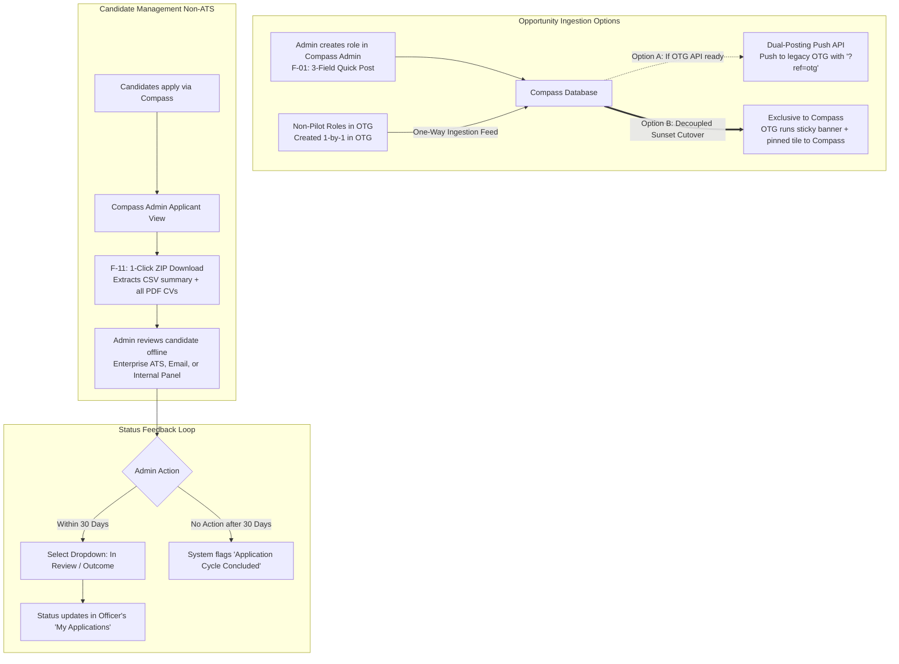

# R1 Dual Journey Map: Officer and Agency Admin Flows

**Date:** 2026-09-16 (Week 38)  
**Status:** Aligned with R1 Strategic Rescope & Non-ATS Leadership Contract  
**Referenced Specs:**  
- [2026-09-16-W38-r1-strategic-rescope-proposal.md](file:///Users/michelleyip/Documents/PM-OS/outputs/analyses/2026-09-16-W38-r1-strategic-rescope-proposal.md)  
- [2026-09-14-W38-r1-opportunities-marketplace-planning-review.md](file:///Users/michelleyip/Documents/PM-OS/outputs/prds/2026-09-14-W38-r1-opportunities-marketplace-planning-review.md)  
- [2026-09-14-W38-decision-r1-opportunity-architecture-and-ats-boundary.md](file:///Users/michelleyip/Documents/PM-OS/outputs/decisions/2026-09-14-W38-decision-r1-opportunity-architecture-and-ats-boundary.md)  

---

## Executive Summary

Here's how day-to-day work changes for officers and agency admins in R1. We're cutting out portal-hopping and endless spreadsheets, giving officers an easy application loop and admins a two-second way to close out candidates without learning an ATS:
1. **The Officer (Job Seeker / Applicant):** Moves from fragmented portals, blind FormSG redirects, and status black holes to a unified catalog, smart profile pre-fill, and closed-loop tracking.
2. **The Agency Admin / Opportunity Owner:** Moves from double-entry posting overhead, scattered spreadsheets, and heavy ATS expectations to a 3-field quick-post, automated OTG coexistence, 1-click dossier download, and 2-second status updates.

---

## Part 1: Officer Journey (The Application Flow)

### 1.1 Before vs After Matrix

| Journey Stage | Legacy OTG / Pre-Pivot Experience | Rescoped Compass R1 Experience | Feature Link |
|---|---|---|---|
| **1. Discover** | Fragmented across OTG (gigs/STIPs), Careers@Gov (vacancies), and agency intranets (rotations/SJRs). Inconsistent search and stale postings. | **Unified 4-Tab Catalog**: Single marketplace covering all 5 opportunity types plus Careers@Gov vacancies. Clear search and filter facets. | `F-17` |
| **2. Evaluate** | Opaque job descriptions. Abrupt redirection to external URLs without context or requirement previews. | **In-App Slide-over Drawer**: Immediate visibility into duration, time commitment, agency background, required skills, and supervisor endorsement rules. | Core UI |
| **3. Profile Pre-Fill** | Zero data retention. Officers had to re-type basic personal data, agency name, designation, and contact details into every form. | **Smart Profile Pre-Fill**: Data automatically pre-populates from existing Compass profile with inline per-application editability. Manual fallback for first-time users. | Rescope Pillar 2 |
| **4. Apply & Submit** | Jarring FormSG redirects with broken mobile views or dead link-outs. | **Partitioned Two-Bucket Submission**:<br>• *Bucket 1 (Gigs/STIPs):* Embedded FormSG intake container, 3-5 fields max.<br>• *Bucket 2 (Rotations/SJRs/Secondments):* Direct PDF CV upload (`F-05`). | `F-01`, `F-05`, `F-28` |
| **5. Track Status** | **The Black Hole**: No confirmation receipt, no status visibility, no notification if a role closed or was filled. | **"My Applications" Dashboard**: 3-stage visual tracker (`Submitted → In Review → Outcome`). Automated 30-day conclusion prevents infinite pending states. | Rescope Pillar 3 |

---

### 1.2 Officer Journey Flowchart

```mermaid
flowchart TD
    Start([Officer logs in via WOG AD]) --> Catalog[Browse 4 Catalog Tabs\nF-17: Gigs, STIPs, Rotations/SJRs, Jobs]
    Catalog --> Drawer[Open Role Detail Drawer\nView specs, commitment, endorsement needs]
    Drawer --> ClickApply{Clicks Apply Now}
    
    ClickApply --> CheckProfile{Has Compass Profile?}
    CheckProfile -->|Yes| PreFill[Pre-fill Name, Agency, Grade, Skills\nAllow inline edits for this role]
    CheckProfile -->|No| ManualEntry[Manual Entry Fallback\nFill basic contact and agency details]
    
    PreFill --> RouteType{Opportunity Type}
    ManualEntry --> RouteType
    
    RouteType -->|Bucket 1: Gig or STIP| Bucket1[Embedded FormSG Intake Container\nAnswer 3 to 5 role-specific questions]
    RouteType -->|Bucket 2: Rotation, SJR, Secondment| Bucket2[Attach PDF CV\nF-05: Direct Upload\nF-28: Flag Supervisor Endorsement]
    RouteType -->|Careers@Gov Vacancy| ExternalLink[Deep-link to Careers@Gov portal]
    
    Bucket1 --> Submit[Submit Application]
    Bucket2 --> Submit
    
    Submit --> Hub[Application appears in 'My Applications']
    Hub --> StatusTrack[Track Status: Submitted → In Review → Outcome]
    StatusTrack --> ExpiryCheck{Admin updates within 30 days?}
    ExpiryCheck -->|Yes| ExplicitOutcome[Outcome Shown: Selected or Not Selected]
    ExpiryCheck -->|No| AutoConclude[Automated: 'Application Cycle Concluded']
```

---

## Part 2: Agency Admin Journey (The Opportunity Lifecycle)

### 2.1 Before vs After Matrix

| Journey Stage | Legacy OTG / Pre-Pivot Experience | Rescoped Compass R1 Experience | Feature Link |
|---|---|---|---|
| **1. Create Posting** | Complex multi-page admin forms in OTG or offline submission to central team. No synchronization across systems. | **3-Field Quick Post (`F-01`)**: Rapid posting in Compass Admin. Compass acts as the primary source of truth. | `F-01` |
| **2. Dual-Posting Sync** | Admin had to post separately in OTG and Compass, causing data drift and double workload. | **Two Deployment Options**:<br>• *Option A (API Bridge):* Compass auto-pushes to OTG via API with `?ref=otg`.<br>• *Option B (Sunset Cutover, Fallback):* Pilot admins post exclusively in Compass; zero manual OTG touch. OTG redirects traffic via sticky banner. | Dual-Posting API / Policy Cutover |
| **3. Non-Pilot Management** | Non-pilot agencies create roles 1-by-1 in OTG. | • *Option A:* Daily central batch with `F-26` deduplication dropping Compass-authored roles.<br>• *Option B:* Compass ingests OTG roles (one-way); non-pilot roles remain searchable in Compass. | `F-26` / Ingestion Feed |
| **4. Candidate Review** | Manually downloading FormSG spreadsheets, matching detached CV emails, or logging into multiple legacy tools. | **1-Click Candidate Dossier Download (`F-11`)**: Downloads a single ZIP containing a consolidated CSV summary and all candidate PDF CVs. | `F-11` |
| **5. Recruitment Pipeline** | Creeping requests for interview scheduling, multi-stage pipelines, and candidate notes inside Compass. | **Strict Non-ATS Boundary**: Compass stays a lightweight marketplace. Admins conduct screening, interviews, and offers offline or in enterprise ATS. | Decision 3 |
| **6. Update Outcome** | Admins rarely updated status because OTG tools were slow, stranding applicants in silence. | **2-Second 3-Stage Dropdown**: Simple status toggle (`Submitted → In Review → Outcome`). 30-day auto-expiry closes loops without manual nagging. | Rescope Pillar 3 |

---

### 2.2 Agency Admin Journey Flowchart



---

## Part 3: Touchpoint Comparison & Friction Mitigations

### 3.1 Officer Touchpoints

| Touchpoint | Potential Friction Point | Rescoped R1 Mitigation |
|---|---|---|
| **First-time login** | Profile is empty, pre-fill has no data. | Clean, non-blocking manual input fallback with optional prompt to save to profile for future applications. |
| **Gigs / STIPs application** | FormSG embed feels clunky on mobile. | Lightweight embedded intake container with clean CSS containerization and max 3-5 fields. |
| **SJR / Rotation application** | Officer forgets supervisor approval or fears career repercussions. | Built-in endorsement declaration (`F-28`) and clear guidance on supervisor communication before applying. |
| **Post-submission wait** | Application sits indefinitely without any updates from agency. | Automated 30-day status resolution rule cleanly marks role as `Application Cycle Concluded`. |

### 3.2 Agency Admin Touchpoints

| Touchpoint | Potential Friction Point | Rescoped R1 Mitigation |
|---|---|---|
| **Initial post setup** | Admin has existing postings on OTG and doesn't want to recreate them. | Dual-posting push syncs new roles to OTG; automated deduplication (`F-26`) ensures central batch runs cleanly. |
| **Candidate review** | Admin has 20 applicants and cannot open 20 individual tabs. | `F-11` compiles all candidate CVs into a single ZIP file alongside a structured CSV manifest in 1 click. |
| **Status reporting** | Admin is overwhelmed with hiring tasks and forgets to update status. | Dropdown requires only 1 click (`In Review` or `Selected`/`Not Selected`), supported by auto-expiry safety net. |

---

## Document History & Alignment

- **2026-07-06 (W28):** Initial exploratory user journey created (pre-pivot).
- **2026-07-15 (W29):** MVP officer journey map created (MVP gauntlet baseline).
- **2026-09-16 (W38):** Comprehensive dual-persona journey map established following the 3-Pillar R1 Strategic Rescope, Non-ATS contract, and dual-posting bridge architecture.
