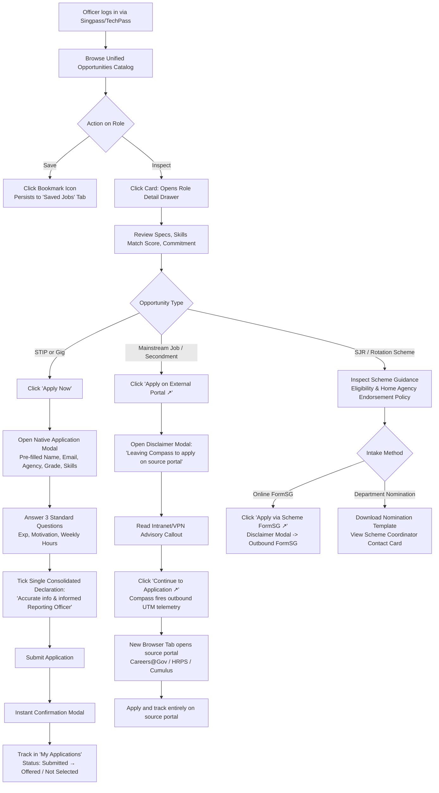

# CareerCompass R1: End-to-End User Journey Map

**Date:** 2026-09-18 (Week 38)  

**Author:** Michelle Yip (PM)  

**Audience:** Li Ting Kway (Product Designer), Barry Lim, Rama Moorthy, Adrian Ang  

**Status:** Aligned with R1 Reduced Scope Baseline & 18 Sep Squad Sync Decisions  

**Related Specs:**  
- [2026-09-18-W38-r1-epic-one-pager.md](../prds/2026-09-18-W38-r1-epic-one-pager.md)  
- [2026-09-18-W38-r1-reduced-scope-feasibility.md](../analyses/2026-09-18-W38-r1-reduced-scope-feasibility.md)  
- [2026-09-18-W38-r1-flow-map-design-instructions.md](2026-09-18-W38-r1-flow-map-design-instructions.md)  
- [2026-09-18-W38-hrps-internal-jobs-api-open-questions.md](../decisions/2026-09-18-W38-hrps-internal-jobs-api-open-questions.md)  

---

## 1. Executive Summary

CareerCompass R1 operates on a **dual-track model** to prevent becoming an unadopted "fourth system":
1. **Track 1 (STIPs & Gigs):** End-to-end native loop. Open self-serve posting by any authenticated officer in pilot agencies, 2-minute pre-filled native apply, transactional email alert, and in-app applicant review table (Offer/Reject).
2. **Track 2 (Mainstream Jobs, Secondments, SJRs):** Unified discovery, search, and intelligent skill-matching. When an officer decides to apply, Compass hands them off cleanly via a disclaimer modal to the originating system (Careers@Gov, HRPS, Cumulus, or scheme FormSG).

---

## 2. Journey 1: The Public Officer (Applicant)



### 2.1 Stage-by-Stage Breakdown

#### Stage 1: Discover & Evaluate
- **Login & Arrival:** Officer logs in via Singpass or TechPass and lands on the unified Opportunities Catalog.
- **Smart Catalog Browsing:** Listings are labeled with clear pills (`Gig`, `STIP`, `Mainstream Job`, `Secondment`, `SJR`). High-match opportunities surface first based on verified profile competencies.
- **Bookmarking:** Clicking the bookmark icon toggles the listing into the officer's "Saved Jobs" filter tab.
- **Detail Drawer:** Clicking any card opens a slide-over drawer displaying:
  - Role overview, required skills, duration, and time commitment.
  - Visual competency match score (e.g., 3 of 4 required skills matched).
  - Outbound destination preview (e.g., "Hosted on Careers@Gov").

#### Stage 2: Apply (Three Divergent Paths)

##### Path A: STIPs & Gigs (Native 2-Minute Apply)
1. **Click Apply:** Officer clicks `Apply Now` in the drawer.
2. **Pre-Filled Form:** Modal opens with verified profile attributes already populated (Name, Email, Agency, Grade, Competencies).
3. **Answer 3 Standard Questions:**
   - Relevant experience (short text, max 500 words).
   - Motivation / learning goals (short text, max 300 words).
   - Weekly availability (dropdown: 2–4 hrs, 4–8 hrs, 8+ hrs).
   *(Fallback: If poster included a FormSG link in the description for bespoke questions, the officer uses that link instead).*
4. **Single Consolidated Declaration:** Ticks: *"I declare that all information submitted is accurate and I have informed my Reporting Officer."*
5. **Submit:** Clicks `Submit Application`. Modal updates to a success confirmation linking to "My Applications".

##### Path B: Mainstream Jobs & Secondments (Discovery & Redirect)
1. **Click Apply:** Officer clicks `Apply on Careers@Gov ↗` or `Apply on Agency Portal ↗`.
2. **Outbound Disclaimer Modal:** Informs the officer:
   - *"You are leaving CareerCompass to apply on [Portal Name]."*
   - *"Intranet Notice: Some agency internal postings require government network (GSIB) or VPN access to view and submit."*
3. **Handoff:** Officer clicks `Continue to Application ↗`. A new browser tab opens the source portal with UTM tracking tags. Compass tracks the redirect event. Application submission and status tracking occur entirely on the source system.

**R1 scope note:** Only Careers@Gov postings and agency-circulated secondments are ingested into the catalog for this path. Internal Job Market and Internal Job listings are excluded pending confirmation from Lee Koon TEU and NCS on API access and eligibility/ringfencing enforcement — see [HRPS Internal Jobs API — Open Questions](../decisions/2026-09-18-W38-hrps-internal-jobs-api-open-questions.md). Surfacing a ringfenced internal posting to an ineligible officer is worse than not listing it, so this stays out of R1 until eligibility can be verified programmatically.

##### Path C: Scheme for Junior Researchers (SJR) & Rotations (Scheme Flow)
1. **Inspect Scheme Guidance:** Drawer highlights formal eligibility rules (e.g., minimum service period, grade criteria) and home agency release policies.
2. **Take Action:**
   - *If Online Intake:* Clicks out via disclaimer modal to the central scheme FormSG.
   - *If Departmental Nomination:* Downloads the official nomination form and accesses the Scheme Coordinator's direct email contact card.

#### Stage 3: Track & Outcome
- **In-App Tracking (Gigs & STIPs Only):** Officer opens "My Applications" to view real-time status badges: `Submitted` → `Offered` or `Not Selected`.
- **Outcome Communication:**
  - **If Offered:** Status badge updates to green `Offered`. The posting creator reaches out directly via email or Teams to coordinate onboarding logistics.
  - **If Not Selected:** Status badge updates to grey `Not Selected`.
  - **If Expired / Closed:** Bookmarked or un-actioned applications show a `Closed` badge for 30 days before being archived.

---

## 3. Journey 2: The Posting Creator (Any Officer in Pilot Agencies)

Any project lead, team manager, or HR officer across the 6 pilot agencies can spin up a STIP or Gig in minutes without administrative gatekeepers.

```mermaid
sequenceDiagram
    autonumber
    actor Creator as Posting Creator (Anybody)
    actor Applicant as Public Officer
    participant Compass as CareerCompass UI
    participant Backend as Backend DB
    participant Postman as GovTech Postman

    %% 1. Post
    Creator->>Compass: Clicks "+ Post a Gig"
    Compass->>Creator: Opens Creation Modal (4 fields + co-evaluators)
    Creator->>Compass: Fills Title, Desc, Agency, Skills, Close Date (+30d)
    Creator->>Compass: Ticks mandatory RO awareness checkbox
    Creator->>Compass: Clicks "Publish"
    Compass->>Backend: Persists posting (Owner = Creator; Status = Active)
    Compass-->>Creator: Shows success confirmation + redirects to "My Posted Gigs"

    %% 2. Application & Notification
    Applicant->>Compass: Submits native standard application
    Compass->>Backend: Saves candidate application
    Backend->>Postman: Triggers transactional email alert
    Postman-->>Creator: "New application received for [Gig Title] from [Name]"

    %% 3. Review & Decision
    Creator->>Compass: Logs in, opens "My Posted Gigs" -> Applicant Review Table
    Compass->>Creator: Renders table (Name, Agency, Skills match, Applied date)
    
    alt Offer Candidate
        Creator->>Compass: Clicks "Offer" button
        Compass->>Backend: Updates status to "Offered"
        Backend-->>Applicant: Status badge updates to "Offered" in "My Applications"
        Creator->>Applicant: Connects offline via Teams/Email for start date
    else Reject Candidate
        Creator->>Compass: Clicks "Reject" button
        Compass->>Backend: Updates status to "Not Selected"
        Backend-->>Applicant: Status badge updates to "Not Selected"
    end

    %% 4. Close Vacancy
    Creator->>Compass: Clicks "Close Vacancy"
    Compass->>Backend: Sets posting status to "Closed" (Unlists from Catalog)
    Backend->>Backend: Starts 90-day retention countdown before permanent data purge
```

### 3.1 Stage-by-Stage Breakdown

#### Stage 1: Quick Creation & Publish (Self-Serve)
1. **Entry Point:** Header button `+ Post a Gig`.
2. **Fill 4 Standard Fields:**
   - Role title and deliverables description (markdown-enabled; includes helper note to paste FormSG link if bespoke screening questions are needed).
   - Host agency and department (pre-filled from profile).
   - Target competencies (pill multi-select).
   - Closing date (default: +30 days; maximum 60 days).
   - Co-evaluators (optional: enters up to 2 `.gov.sg` emails).
3. **Mandatory RO Checkbox:** Ticks: *"I confirm my Reporting Officer is aware of this gig posting."*
4. **Publish:** Clicks `Publish`. The role goes live immediately across the 6 pilot agencies.

#### Stage 2: Alert & Candidate Review
1. **Transactional Alert:** Creator receives an automated email via GovTech Postman: *"New application received for [Gig Title] from [Officer Name]."*
2. **Open Applicant Review Table:** Creator navigates to "My Posted Gigs" and clicks `View Applicants`. Co-evaluators have the exact same view.
3. **Screen Applicants:** Reviews a decision table displaying:
   - Candidate Name, Agency, and Grade.
   - Competency Match Score (e.g., 3 of 4 skills matched).
   - Date applied.
   - Expanding a row displays the candidate's 3 standard question responses.

#### Stage 3: Decision & Offboarding
1. **1-Click Selection:**
   - **Offer:** Clicks `Offer`. A dialog reminds the creator to coordinate directly via email or Teams for onboarding. Applicant's in-app badge updates to `Offered`.
   - **Reject:** Clicks `Reject`. Applicant's in-app badge updates to `Not Selected`.
2. **Close Vacancy:** Once the gig is filled, creator clicks `Close Vacancy`. The posting is unlisted from the catalog, and candidate records enter the 90-day retention countdown before permanent data purge.

---

## 4. Cross-Opportunity Summary Matrix

| Dimension | STIPs & Gigs | Mainstream Jobs (Public Vacancies) | Secondments & Rotations | Scheme for Junior Researchers (SJR) |
|---|---|---|---|---|
| **Posting Mechanism** | Self-serve by any officer in Compass | Ingested via Careers@Gov feed (F-23) | Curated batch / agency circulars | Curated central agency circulars |
| **Where Officer Discovers** | CareerCompass Catalog | CareerCompass Catalog | CareerCompass Catalog | CareerCompass Catalog |
| **Where Officer Applies** | **Native in Compass** (Pre-filled modal) | **External** (Careers@Gov portal) | **External** (Originating HR portal) | **External** (Scheme FormSG or offline memo) |
| **Application Time** | <2 minutes | 15–30 minutes (re-typing on C@G) | Varies by agency portal | Offline nomination workflow |
| **Where Status is Tracked** | **In-App** ("My Applications" badge) | External portal only | External portal / agency email | Direct email from scheme coordinator |
| **Poster / Reviewer Tool** | **In-App Applicant Review Table** (Offer/Reject) | Enterprise ATS / C@G backend | Originating agency HR system | Central committee spreadsheet |
| **Data Retention Rule** | Purged 90 days post-closure | Governed by Careers@Gov | Governed by source HR system | Governed by scheme coordinator |

---

## 5. Cross-Cutting Flow: Saved Jobs (Bookmark Lifecycle)

```
[View Role Card] ──> [Click Bookmark Icon] ──> [Saved in Officer Account]
                                                        │
                         ┌──────────────────────────────┴──────────────────────────────┐
                         ▼                                                             ▼
                 [Active Role]                                                  [Role Closes]
             Renders normally in Saved Tab                                  Shows 'Closed' grey badge
                                                                            Retained for 30 days
                                                                                       │
                                                                                       ▼
                                                                           Auto-purged from list
```

- **Bookmark Action:** Single-click toggle on opportunity cards and detail drawers (Ghost outline → Solid fill with optimistic UI update).
- **Saved Jobs View:** Accessible via the dedicated filter tab on `/opportunities?tab=saved`.
- **Closed Role Behavior:** When a bookmarked opportunity reaches its closing date or is closed early by the poster, it remains visible with a prominent `Closed` grey badge at 70% opacity for 30 days before being automatically purged from the list.
