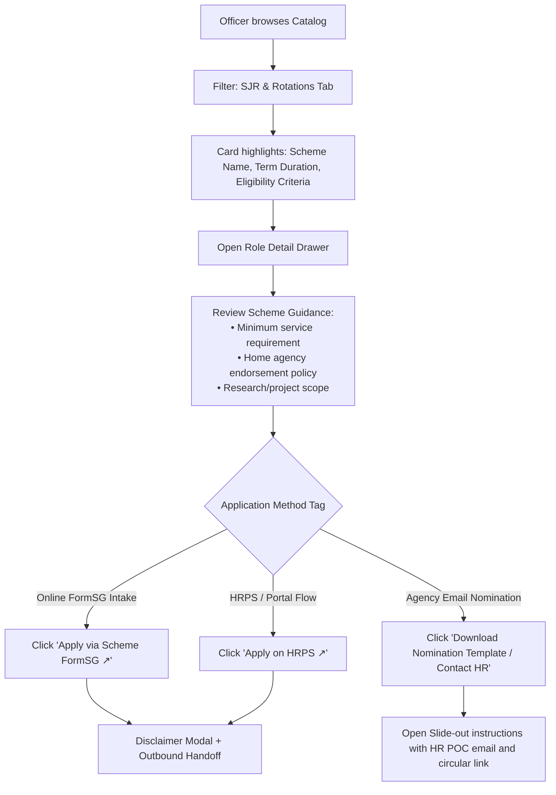
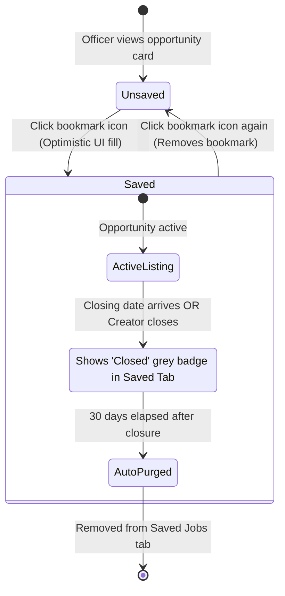

# R1 Flow Map Design Instructions: STIPs/Gigs, Internal Jobs, Secondments & SJRs

**Date:** 2026-09-18 (Week 38)  
**Author:** Michelle Yip (PM)  
**Audience:** Li Ting Kway (Liting, Product Designer), Barry Lim, Rama Moorthy  
**Purpose:** Provide step-by-step design specifications, decision nodes, and system states to build the user flow maps in Figma/FigJam before the 30 October 2026 design freeze.

---

## 1. Executive Summary & Flow Architecture

CareerCompass R1 operates on a **dual-track architecture**. The flow map must visually separate native in-app workflows from aggregated external discovery:

```
                                  [Opportunities Catalog]
                                             │
                   ┌─────────────────────────┴─────────────────────────┐
                   ▼                                                   ▼
       [Track 1: STIPs & Gigs]                      [Track 2: Internal Jobs, Secondments, SJRs]
         (Native In-App Loop)                          (Aggregated Discovery & External Handoff)
                   │                                                   │
     • Open posting by anybody                            • Ingestion via C@G / Curated feeds
     • Pre-filled standard application form               • Competency match & role preview drawer
     • In-app review drawer (Offer/Reject)                • Outbound redirect with disclaimer modal
     • In-app status badge (Submitted/Offered/Not Sel)    • Application completed on HRPS/Cumulus/C@G
```

---

## 2. Flow Map 1: STIPs & Gigs (End-to-End Native Loop)

STIPs and Gigs represent the only opportunity type where Compass owns the full value loop.

### 2.1 User Swimlanes & Steps

```mermaid
sequenceDiagram
    autonumber
    actor Poster as Posting Creator (Anybody)
    actor Officer as Public Officer (Applicant)
    participant Compass as CareerCompass (Web/App)
    participant DB as Compass Backend / DB
    participant Postman as GovTech Postman (Email)

    %% Step 1: Posting
    Poster->>Compass: Clicks "Post a Gig"
    Compass->>Poster: Displays 4-field creation form + Co-evaluators field
    Poster->>Compass: Fills title, details, competencies, closing date + ticks RO checkbox
    Poster->>Compass: Clicks "Publish"
    Compass->>DB: Stores posting (Owner = Poster; Status = Active; 30-day expiry)
    
    %% Step 2: Discovery & Apply
    Officer->>Compass: Browses catalog, clicks STIP/Gig card
    Compass->>Officer: Opens Role Drawer (Details, skills match, commitment)
    Officer->>Compass: Clicks "Apply Now"
    Compass->>DB: Fetches officer profile (Name, Agency, Grade, Skills)
    Compass->>Officer: Opens Standard Application Modal (Pre-filled + 2-3 text fields)
    Officer->>Compass: Completes answers, ticks RO declaration, clicks "Submit"
    Compass->>DB: Saves application (Status: Submitted)
    Compass->>Officer: Shows Instant Success Screen ("Application Sent")
    
    %% Step 3: Notification & Review
    DB->>Postman: Triggers transactional email alert
    Postman->>Poster: "New application received for [Gig Title] from [Name]"
    Poster->>Compass: Logs in, opens "My Posted Gigs" -> Candidate Drawer
    Compass->>Poster: Renders candidate table (Name, Agency, Skills match, Date)
    
    %% Step 4: Decision
    alt Offer Candidate
        Poster->>Compass: Clicks "Offer" button
        Compass->>DB: Updates status to "Offered"
        DB-->>Officer: In-app badge updates to "Offered"
        Poster->>Officer: Reaches out via Email/Teams for onboarding
    else Reject Candidate
        Poster->>Compass: Clicks "Reject" button
        Compass->>DB: Updates status to "Not Selected"
        DB-->>Officer: In-app badge updates to "Not Selected"
    end
```

### 2.2 Detailed Screen Inventory & States for Liting

#### A. Posting Creation Flow (Creator: Anybody)
1. **Entry Point:** Primary button in navigation/header: `+ Post a Gig`.
2. **Creation Modal (Screen G-01):**
   - Field 1: Role Title (Text input, max 100 chars).
   - Field 2: Description & Deliverables (Markdown-enabled rich text; helper text: *"Paste a FormSG link here if custom screening questions are required"*).
   - Field 3: Host Agency & Department (Pre-filled from poster's profile, editable dropdown).
   - Field 4: Target Competencies / Skills (Multi-select pill selector).
   - Field 5: Closing Date (Date picker; default set to +30 days from today).
   - Field 6: Co-Evaluator Emails (Optional text box; accepts up to 2 `.gov.sg` emails).
   - Mandatory Checkbox: *"I confirm my Reporting Officer is aware of this gig posting."*
3. **Validation & Errors:**
   - Block publish if required fields are missing or if closing date exceeds 60 days.
   - Non-governmental emails in co-evaluator field trigger inline error: *"Must be a valid .gov.sg email address."*
4. **Publish Confirmation (Screen G-02):**
   - Success toast + redirect to "My Posted Gigs".

#### B. Applicant Apply Flow (Officer)
1. **Entry Point:** Slide-over Role Drawer `Apply Now` button.
2. **Application Modal (Screen G-03):**
   - **Pre-filled Section (Read-Only with Edit Link):** Name, Official Email, Agency, Grade/Designation, and Verified Competencies.
   - **Custom Input Section (Standard):**
     - Field 1: Relevant Experience (Textarea, max 500 words).
     - Field 2: Motivation / What you hope to learn (Textarea, max 300 words).
     - Field 3: Estimated weekly hours available (Dropdown: 2-4 hrs, 4-8 hrs, 8+ hrs).
   - **Single Consolidated Declaration Checkbox:** *"I declare that all information submitted is accurate and I have informed my Reporting Officer."*
   - Actions: `Submit Application` (Primary) and `Cancel` (Secondary).
3. **Submission Confirmation (Screen G-04):**
   - Modal transforms into success confirmation with link: `View in My Applications`.

#### C. Review Drawer & Candidate Management (Creator & Co-evaluators)
1. **Entry Point:** Navigation link `My Posted Gigs` -> Select active posting -> `View Applicants (N)`.
2. **Review Drawer (Screen G-05):**
   - Compact table layout displaying:
     - Candidate Name & Agency.
     - Competency Match Score (e.g., 3 of 4 skills matched).
     - Current Grade & Role.
     - Submission Date.
     - Actions: `Offer` (Green outline button), `Reject` (Subtle grey button).
   - Expanding a row reveals candidate's 3 standard text answers.
3. **Decision Confirmation Dialogs:**
   - Clicking **Offer**: Modal confirms: *"Confirm offer to [Name]? This will update their application status in CareerCompass. Please connect directly via email or Teams to coordinate onboarding."*
   - Clicking **Reject**: Modal confirms: *"Mark [Name] as Not Selected? Their in-app status will be updated."*
4. **Vacancy Lifecycle Controls:**
   - Header button: `Close Vacancy`. Closing early removes posting from the public catalog and triggers the 90-day retention countdown.

---

## 3. Flow Map 2: Mainstream Jobs & Secondments (Discovery & Redirect)

Mainstream civil service jobs and cross-agency secondments originate outside Compass (in Careers@Gov, HRPS, or Cumulus). Compass provides unified discovery and intelligent search, routing candidates externally for application.

### 3.1 User Flow Diagram

```mermaid
flowchart TD
    A[Officer logs in to CareerCompass] --> B[Browse Opportunities Catalog]
    B --> C[Filter: Mainstream Jobs / Secondments]
    C --> D[Opportunity Card shows Host Agency, Skills Match, Role Type]
    
    D --> E[Click Card: Opens Role Detail Drawer]
    E --> F{Evaluate Role}
    
    F -->|Bookmark| G[Click Bookmark Icon: Persists to 'Saved Jobs']
    F -->|Apply| H[Click 'Apply on External Portal']
    
    H --> I[Open Disclaimer Modal:\n'You are leaving CareerCompass to apply on [Portal Name]']
    I --> J{Intranet Notice Displayed:\n'Note: Internal system access may require civil service intranet/VPN'}
    
    J --> K[Click 'Continue to External Portal']
    K --> L[Compass fires outbound telemetry beacon\nwith UTM tracking tags]
    L --> M[New Browser Tab opens source portal\nCareers@Gov / HRPS / Cumulus]
    M --> N[Officer completes application on source portal]
```

### 3.2 Detailed Screen Inventory & States for Liting

1. **Catalog Card (Screen M-01):**
   - Distinct badge indicator: `External Vacancy` or `Careers@Gov`.
   - Clear icon showing an external redirect arrow (`↗`).
2. **Role Detail Drawer (Screen M-02):**
   - Overview, key responsibilities, requirements, and competency match indicator.
   - Primary CTA: `Apply on Careers@Gov ↗` or `Apply on Agency Portal ↗`.
3. **Outbound Disclaimer Modal (Screen M-03):**
   - **Headline:** *"You are leaving CareerCompass"*
   - **Body Copy:** *"This position is hosted on [Portal Name, e.g., Careers@Gov]. Your application will be submitted and tracked entirely on that system."*
   - **Callout Box (Amber Alert):** *"Intranet Notice: Some agency internal postings require government network (GSIB) or VPN access to view and submit."*
   - **Actions:** `Continue to Application ↗` (Primary) and `Back to Compass` (Secondary).
4. **Telemetry Beacon (Invisible / Technical State):**
   - On clicking Continue, frontend emits: `outbound_redirect_clicked` with `opportunity_id`, `source_portal`, and `officer_agency`.

---

## 4. Flow Map 3: Scheme for Junior Researchers (SJR) & Rotations

SJRs and structured rotation schemes have strict eligibility requirements and are frequently coordinated via central agency circulars rather than standard online job postings.

### 4.1 User Flow Diagram



### 4.2 Detailed Screen Inventory & States for Liting

1. **SJR Role Detail Drawer (Screen R-01):**
   - Prominent metadata pills: `Duration: 12 Months`, `Commitment: Full-time Secondment`, `Eligibility: Grade X and above`.
   - **Endorsement Checklist Block:**
     - Reminder that SJRs require home agency division head / HR clearance prior to submission.
2. **Application Action Container (Screen R-02):**
   - If online form: Outbound CTA to verified scheme FormSG.
   - If offline nomination: Secondary action card providing:
     - Link to download official nomination form.
     - Contact email of Scheme Coordinator (`mailto:` link).

---

## 5. Cross-Cutting Flow: Saved Jobs (Bookmark Lifecycle)

Applies across all opportunity types (Gigs, STIPs, Mainstream Jobs, SJRs).

### 5.1 Bookmark State Machine



### 5.2 Screen States for Liting

1. **Opportunity Card Bookmark Icon:**
   - Default: Ghost outline bookmark icon.
   - Hover: Accent highlight.
   - Active: Solid filled bookmark icon with subtle bounce micro-animation.
2. **Saved Jobs Tab View (Screen S-01):**
   - Dedicated filter tab on `/opportunities?tab=saved`.
   - Empty State: *"No saved opportunities yet. Click the bookmark icon on any opportunity card to save it for later."*
   - When a saved role closes: Card renders at 70% opacity with a prominent grey badge: `Closed`. Stays in view for 30 days so the officer understands the outcome, then disappears.

---

## 6. Checklist & Deliverables for Liting (Figma Wireframes)

To ensure wireframes freeze cleanly by **30 October 2026** before year-end leave, focus design delivery strictly on these screens:

| Screen Code | Screen Name | Priority | Core Elements to Wireframe |
|---|---|---|---|
| **G-01** | Post a Gig (Creation Modal) | P0 | Title, Description (markdown helper), Agency, Skills selector, Closing date (+30d default), Co-evaluators field, RO checkbox. |
| **G-03** | Fixed Standard Apply Modal | P0 | Pre-filled profile fields (Name, Email, Agency, Grade, Skills), 2-3 standard text boxes, consolidated RO declaration checkbox. |
| **G-05** | Candidate Review Drawer | P0 | Applicant table (Name, Agency, Skills match, Applied date), expandable row for text answers, **Offer** and **Reject** action buttons. |
| **G-06** | Offer / Reject Confirmation Modals | P0 | Dialog copy instructing hiring manager to connect directly via Teams/Email for offer logistics. |
| **M-02** | External Vacancy Detail Drawer | P1 | Role specs, external link indicator, skills match score. |
| **M-03** | Outbound Redirect Disclaimer Modal | P1 | Notice that application is on external portal, amber callout regarding civil service intranet/VPN requirement. |
| **R-01** | SJR / Rotation Scheme Drawer | P2 | Scheme terms, home agency endorsement advisory, offline nomination / form linkout container. |
| **S-01** | Saved Jobs Filter & Closed States | P1 | Card bookmark icon toggle, saved tab list, 30-day "Closed" badge card state. |

---

## 7. Edge Cases & Error States to Include in Flow Maps

1. **Stale / Missing Profile Data on Native Apply:** If an officer's pre-filled competencies or agency are missing, provide an inline *"Edit in Profile"* link that saves profile changes back to Compass.
2. **Expired Role Attempt:** If an officer clicks "Apply" on a gig that the creator closed seconds prior, show an inline banner: *"This opportunity has closed and is no longer accepting applications."*
3. **Off-Intranet Redirect Failure:** For mainstream jobs, the disclaimer modal must explicitly state: *"If this page fails to load, please ensure you are connected to the Civil Service intranet or government VPN."*
4. **Co-Evaluator Permission Collision:** If a non-whitelisted email or public email is entered in the co-evaluator field, show: *"Only valid public service (.gov.sg) email addresses can be added as co-evaluators."*
