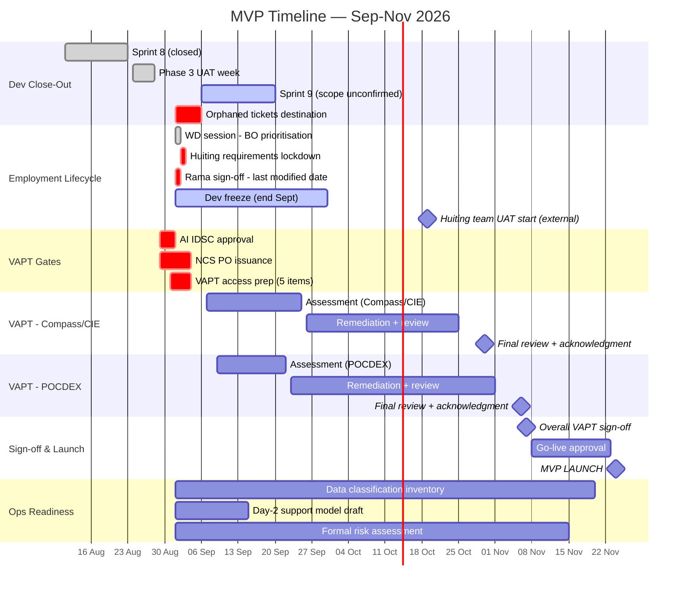

# MVP Timeline — Work Breakdown Structure & Gantt Chart

**Prepared:** 2026-09-01 (W36)

**Target launch:** 24–25 Nov 2026 (Adrian Ang, confirmed 25 Aug 2026)

**Sources:** `00-hub/risks.md`, `00-hub/open-items.md` #39/#60, live Jira (board 12541), Jobelle's VAPT schedule (31 Aug), 2026-08-31 bi-weekly sync with Adrian Ang

---

## How to read this document

- **WBS** breaks the remaining MVP work into phases → workstreams → deliverables, each with an owner and dependency.
- **Gantt** renders the same structure on a calendar, as a Mermaid diagram (renders natively in most markdown viewers and in Claude Artifacts).
- **Confidence markers:** ✅ Confirmed date (named source) · 🟡 Estimated/working assumption · 🔴 At risk / unresolved

---

## 1. Work Breakdown Structure (WBS)

### 1.0 MVP Launch (Milestone)
**Target:** 24–25 Nov 2026 ✅ (Adrian Ang, 25 Aug)

---

### 1.1 Development Close-Out
| WBS # | Deliverable | Owner | Dates | Confidence |
|---|---|---|---|---|
| 1.1.1 | Sprint 8 close (final MVP dev sprint) | Team | 11–23 Aug (closed 1 day early) | ✅ Done |
| 1.1.2 | Phase 3 UAT week (no dev sprint) | Team | 24–28 Aug | ✅ Done |
| 1.1.3 | Sprint 9 (scope: VAPT/UAT continuation vs. real dev — unconfirmed) | Team | 6–20 Sep | ✅ Dates confirmed (live Jira); 🔴 scope unresolved |
| 1.1.4 | 20 orphaned Sprint 8 tickets (6 WOG AD/auth-adjacent) get a confirmed destination | Rama/Adrian → Léo/Thomas | Before Sprint 9 planning closes | 🔴 At risk — unresolved 2+ weeks |
| 1.1.5 | Code freeze confirmation | Team | ~28 Aug (stated, not independently confirmed) | 🟡 Needs direct confirmation |

---

### 1.2 Employment Lifecycle / Day-2 Changes *(new, tightened 31 Aug)*
| WBS # | Deliverable | Owner | Dates | Confidence |
|---|---|---|---|---|
| 1.2.1 | Scope narrowed to 4 domains: job ID, job family, job function, competency | Adrian (decision) | Decided 31 Aug | ✅ Confirmed |
| 1.2.2 | Test rationalisation + 3 hypotheses + AGD/MTI/MDDI findings | Michelle | Delivered 31 Aug, feeds Tue 1 Sep WD session | ✅ Done |
| 1.2.3 | BO prioritisation of ~11-case cut (POCDEX Day-2) | Imelda | Tue 1 Sep WD session | ✅ Scheduled |
| 1.2.4 | 50-of-118 test case commitment to Huiting's team | Adrian, Michelle | Requirements lockdown expected Wed 2 Sep | 🔴 **Unreconciled against 1.2.3's ~11-case cut** — same universe or different? Must resolve before Wed |
| 1.2.5 | "Last modified date" business rule sign-off (Rama) | Rama | Before Wed 2 Sep | 🔴 Accepted by Adrian 31 Aug, Rama sign-off still pending |
| 1.2.6 | Employment-lifecycle **development freeze** | Team | **End of September** | ✅ Confirmed 31 Aug (Adrian) — driven by 1.2.7 |
| 1.2.7 | External driver: Huiting's team's Compass employment-profile UAT start | Huiting's team | **19 October** | ✅ Stated by Adrian 31 Aug — first appearance in any tracker |

---

### 1.3 VAPT (Vulnerability Assessment & Penetration Testing)
| WBS # | Deliverable | Owner | Dates | Confidence |
|---|---|---|---|---|
| 1.3.1 | AI IDSC approval (hard gate) | WD | ~1 Sep | 🟡 Estimated, unconfirmed as started |
| 1.3.2 | NCS PO issuance (hard gate) | Procurement | By 4 Sep | 🟡 In progress per 24 Aug confirmation |
| 1.3.3 | VAPT scope/access walkthrough with NCS | Rama, Adrian, Benjamin, Johnny | 31 Aug | ✅ Done |
| 1.3.4 | Compass (Cloud/Web/API) + CIE (Cloud) assessment window | NCS | 7–25 Sep | ✅ Confirmed (Jobelle's schedule) |
| 1.3.5 | POCDEX (Cloud/API) assessment window | NCS | 9–22 Sep | ✅ Confirmed (Jobelle's schedule, corrected from earlier 7 Sep / 23 Sep figures) |
| 1.3.6 | 5 hard-prerequisite access items (accounts, API docs, EC2 jump hosts, IAM roles, test data) | Adrian, Benjamin, Rama, Johnny | Due 31 Aug–4 Sep | 🔴 In Progress, no items confirmed complete yet |
| 1.3.7 | CIE/CV retraining change-scope risk (Victor) — realistically lands end-Sep, inside VAPT freeze window | Victor | Before 7 Sep | 🔴 Unconfirmed technically |
| 1.3.8 | Compass + CIE remediation → final review → acknowledgment | Team + NCS | 26–30 Oct | ✅ Confirmed (Jobelle's schedule) |
| 1.3.9 | POCDEX remediation → final review → acknowledgment | Team + NCS | 2–6 Nov | ✅ Confirmed (Jobelle's schedule) |
| 1.3.10 | Overall VAPT sign-off | Team | ~7 Nov | ✅ Confirmed (Adrian, 25 Aug) — gated by 1.3.9 |
| 1.3.11 | Readiness governance: add "Test-start blocker? (Y/N)" column to Jobelle's schedule | Michelle → Jobelle/Rama | This week | 🟡 Proposed, not yet actioned |

---

### 1.4 Data & Operational Readiness
| WBS # | Deliverable | Owner | Dates | Confidence |
|---|---|---|---|---|
| 1.4.1 | Field-level data classification inventory | Jace (drive), Michelle (support) | Started this week | 🟡 New workstream, no target date yet |
| 1.4.2 | Day-2 support model + SLA first-cut proposal | Rama, Adrian Lo | "Discussion-starter due next week" (as of 28 Aug) | 🟡 No confirmed date |
| 1.4.3 | Formal risk assessment (cyber, data, project, cloud) | Jace | Not started | 🔴 No owner-confirmed date |
| 1.4.4 | Go-live readiness checklist (comms, people, system, perf, security, access, monitoring, docs, support, contingency) | Jace (drive) | Adopted 28 Aug, not yet populated | 🟡 Framework exists, content TBD |

---

### 1.5 Launch
| WBS # | Deliverable | Owner | Dates | Confidence |
|---|---|---|---|---|
| 1.5.1 | Go-live approval | Leadership | Before 24 Nov | 🟡 Depends on 1.3.10 clearing cleanly |
| 1.5.2 | **MVP Launch** | Team | **24–25 Nov 2026** | ✅ Confirmed (Adrian, 25 Aug) |

---

## 2. Critical Path

```
Sprint 8 close (23 Aug) → Phase 3 UAT (24-28 Aug) → Sprint 9 opens (6 Sep)
                                                          │
                    ┌─────────────────────────────────────┼──────────────────────────┐
                    │                                      │                          │
        Employment lifecycle scope            AI IDSC (~1 Sep) +          VAPT prep (5 items,
        narrowed & frozen end-Sep             NCS PO (~4 Sep)              due 31 Aug-4 Sep)
                    │                                      │                          │
        (Huiting's 19 Oct UAT is the                       └──────────┬───────────────┘
         external driver — off critical                               │
         path for MVP launch itself,                      VAPT: Compass/CIE 7-25 Sep,
         but drives internal Sept freeze)                  POCDEX 9-22 Sep
                                                                        │
                                                      Remediation → Final review → Ack.
                                                      Compass/CIE: 26-30 Oct
                                                      POCDEX: 2-6 Nov
                                                                        │
                                                          Overall VAPT sign-off (~7 Nov)
                                                                        │
                                                              Go-live approval
                                                                        │
                                                        ⭐ MVP LAUNCH — 24-25 Nov 2026
```

**The real critical path runs through VAPT, not employment-lifecycle work** — POCDEX's 2-6 Nov close is the last gate before the ~7 Nov sign-off, and 24-25 Nov gives roughly a 2.5-week buffer after that. Employment-lifecycle's end-September freeze is a *parallel* constraint (driven by an external deadline, Huiting's 19 Oct UAT) rather than something that gates the 24-25 Nov date directly — but if it slips, it competes for the same Rama/engineering capacity VAPT remediation needs in October.

---

## 3. Gantt Chart



---

## 4. Open Risks Feeding This Timeline

| Risk | Impact on this Gantt | Status |
|---|---|---|
| Sprint 9's real scope (dev work vs. VAPT/UAT window) unconfirmed | Affects whether 20 orphaned tickets and any remaining dev work has a home | 🔴 Open |
| 50-case (Huiting) vs. 11-case (Imelda BO cut) — same scope or different? | Could change the size of 1.2.4's deliverable before Wed's lockdown | 🔴 Open, deadline Wed 2 Sep |
| CIE/CV retraining lands end-Sept, inside the VAPT freeze window | Could force re-characterizing a release as more than "minor/logic-only," risking a full VAPT re-cycle | 🔴 Unconfirmed technically (Victor) |
| No consolidated "Test-start blocker" flag on VAPT readiness | Masks whether the 5 hard-prerequisite items are actually done vs. assumed done | 🟡 Proposed fix pending |
| Adrian away 5–9 Oct (mid-VAPT); Jace away 26 Oct–5 Nov | Overlaps both VAPT remediation window and Compass/CIE closure — named coverage: Adrian/Rama/Barry/Pow Hwee | ✅ Coverage named, not yet stress-tested |
| R1's second VAPT cycle (unsized, verbally floated 31 Aug) | Not on this Gantt — R1 hasn't started scoping; flagged as a future planning input, not a current-timeline risk | 🟡 Parking lot item |

---

## 5. What This Document Does Not Cover

- **R1 timeline** — deliberately excluded. R1 development can't meaningfully start until MVP capacity frees up (see 2026-09-01 conversation on R1 sequencing); a separate WBS/Gantt should be built once R1 scoping (creation, CAM integration, second VAPT cycle) is sized.
- **CAM integration** — deferred out of MVP into R1 (decided 28 Aug); not on this timeline.
- **Detailed sub-tasks within each deliverable** (e.g., individual Jira tickets) — this WBS stops at the deliverable level; see live Jira (board 12541) for ticket-level detail.

---

*Generated: 2026-09-01. Sources: `00-hub/risks.md` (updated 2026-08-31), `00-hub/open-items.md` #39/#60, live Jira pull (board 12541, 2026-08-31), Jobelle's VAPT schedule (31 Aug), 2026-08-31 bi-weekly sync with Adrian Ang, VAPT scope walkthrough meeting notes.*
*Next: confirm Sprint 9's real scope and the 50-vs-11 test case question before Wednesday — both directly affect whether sections 1.1 and 1.2 of this WBS hold as drafted.*
